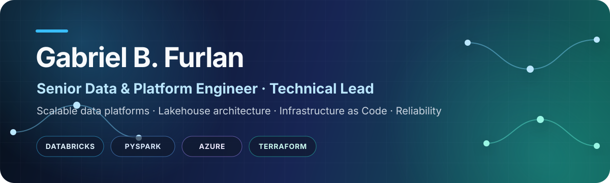

  

  
  
  

  <strong>Vitória, Brazil</strong> · Italian / EU citizen · Eligible to work in the European Union · Open to remote and international opportunities

  I design, scale, and operate dependable data platforms — from architecture and infrastructure to delivery, observability, and production recovery.

## Impact at a glance

<table>
  <tr>
    <td align="center" width="33%"><strong>22+</strong> countries served</td>
    <td align="center" width="33%"><strong>50M+</strong> records processed daily</td>
    <td align="center" width="33%"><strong>100K+</strong> users impacted by models</td>
  </tr>
  <tr>
    <td align="center"><strong>99.9%</strong> platform reliability</td>
    <td align="center"><strong>~35%</strong> runtime reduction</td>
    <td align="center"><strong>~20%</strong> infrastructure cost reduction</td>
  </tr>
</table>

Senior Data and Platform Engineer with **10+ years building production data and software systems** and **4+ years specializing in Azure Databricks, distributed data platforms, Infrastructure as Code, CI/CD, observability, and reliability engineering**.

I am a technical owner of a global personalization platform, with end-to-end responsibility for architecture, deployment strategy, developer experience, model-output delivery, reliability, and production operations.

## How I operate

<table>
  <tr>
    <td width="50%" valign="top">
      <h3>Platform ownership</h3>
      Own architecture, deployment strategy, developer experience, reliability, and production operations across global data and ML workloads.
    </td>
    <td width="50%" valign="top">
      <h3>Technical leadership</h3>
      Mentor engineers, review code and RFCs/design documents, lead architecture reviews, and turn recurring decisions into engineering standards.
    </td>
  </tr>
  <tr>
    <td width="50%" valign="top">
      <h3>Reliability engineering</h3>
      Design observability, idempotency, reconciliation, safe reprocessing, incident response, RCA, and recovery paths for distributed systems.
    </td>
    <td width="50%" valign="top">
      <h3>Cross-functional delivery</h3>
      Partner with business, data science, engineering, and global platform stakeholders across distributed international teams.
    </td>
  </tr>
</table>

## Core technologies

**Data and ML platforms**

**Cloud, infrastructure, and software engineering**

**Integration, quality, and operations**

## Featured work

<table>
  <tr>
    <td width="50%" valign="top">
      <h3><a href="https://github.com/gabrafur/customer-engagement-data-platform">Customer Engagement Data Platform</a></h3>
      
Production-inspired, end-to-end data platform built with synthetic data and explicit clean-room boundaries.

      
<strong>Demonstrates</strong>

      <ul>
        <li>PySpark feature engineering and Delta Lake MERGE semantics</li>
        <li>Deterministic scoring, data-quality gates, and orchestration</li>
        <li>Transactional outbox, replay, reconciliation, CI, and tests</li>
      </ul>
      
<code>Python</code> <code>PySpark</code> <code>Delta Lake</code> <code>Databricks</code>

      

        
        
      

    </td>
    <td width="50%" valign="top">
      <h3><a href="https://github.com/gabrafur/my_smart_home">My Smart Home</a></h3>
      
Continuously operated, self-hosted platform treated as an event-driven distributed system rather than a collection of device automations.

      
<strong>Demonstrates</strong>

      <ul>
        <li>Event-driven architecture, integration engineering, and state recovery</li>
        <li>Versioned infrastructure, observability, and guarded upgrades</li>
        <li>Privacy boundaries and optional local-AI/agent integrations</li>
      </ul>
      
<code>Python</code> <code>Node-RED</code> <code>MQTT</code> <code>Docker</code>

      

        
        
      

    </td>
  </tr>
</table>

> All public portfolio projects use synthetic or sanitized data and contain no proprietary employer source code, production data, credentials, or internal business logic.

## Career highlights

| Organization | Role and selected impact | Period |
| --- | --- | :---: |
| **Anheuser-Busch InBev / BEES** | Technical owner of a global personalization platform serving 22+ countries and processing 50M+ records/day. | 2025–Present |
| **Ambev** | Built and operated Azure Databricks platforms, distributed promotion processing for 200K+ monthly campaigns, and optimizations reducing cloud processing costs by ~70%. | 2022–2025 |
| **Santander Brazil** | Led data engineering for real-time anti-fraud across 1B+ transactions, contributing to an ~80% reduction in fraud losses (~US$200M). | 2019–2022 |
| **Itaú Unibanco** | Led forecasting, workforce optimization, and real-time routing initiatives generating more than US$15M/year in operational savings. | 2016–2019 |

## Background and current focus

<table>
  <tr>
    <td width="50%" valign="top">
      <h3>Education</h3>
      <ul>
        <li><strong>Postgraduate Specialization in Data Engineering</strong> Escola Politécnica da USP</li>
        <li><strong>Bachelor's in Aerospace Engineering</strong> Universidade Federal do ABC</li>
        <li><strong>Technical Degree in Electrotechnics</strong> IFES</li>
      </ul>
    </td>
    <td width="50%" valign="top">
      <h3>Current development</h3>
      <ul>
        <li>Preparing for the <strong>Databricks Certified Data Engineer Professional</strong> examination</li>
        <li>Deepening expertise in <strong>Generative AI, agent engineering, MLOps, data architecture, and platform engineering</strong></li>
        <li><strong>Portuguese:</strong> native · <strong>English:</strong> B2 professional · <strong>Spanish:</strong> basic</li>
      </ul>
    </td>
  </tr>
</table>

## Opportunities

I am open to Senior or Staff-level roles in **Data Engineering, Data Platform Engineering, Data Architecture, or MLOps**, especially opportunities involving global platforms, technical leadership, reliability, and complex distributed systems.

  

